# AI YouTube Transcript Summarizer 🎓🎥

A premium, production-ready Streamlit application that fetches YouTube transcripts, processes them using state-of-the-art LLMs (Google Gemini API / Groq API), and outputs beautiful, structured educational study notes, timelines, interactive quizzes, and recall flashcards.

---

## 🌟 Core Features

- **Robust URL Parsing**: Seamlessly processes standard URLs, mobile links (`youtu.be`), YouTube Shorts, and embed links.
- **Language & Translation Fallback**: Automatically fetches English transcripts. If not available, grabs foreign-language transcripts (Hindi, Spanish, etc.) and translates them using YouTube's built-in translation API, falling back to any raw auto-generated transcript if needed.
- **7 Summary Tones & Styles**: Customize study notes for different workflows:
  - *Short Summary* (Quick, high-level overview)
  - *Detailed Summary* (Deep-dive, extensive explanations)
  - *Bullet Notes* (Highly scannable hierarchical list)
  - *Academic Notes* (Rigorous textbook-style language)
  - *Beginner Friendly* (Simple analogies, easy-to-understand explanations)
  - *Interview Preparation* (System design questions and engineering trade-offs)
  - *Exam Revision* (Focuses on active recall, facts, and equations)
- **13 Mandated Content Blocks**: Every note includes:
  1. Video Title
  2. Executive Summary
  3. Detailed Summary
  4. Timeline Summary (mapping topics to chronological timestamps)
  5. Key Takeaways
  6. Important Quotes
  7. Technical Concepts Definitions
  8. Actionable Insights
  9. 5-Minute Quick Revision Notes
  10. 5 Multiple-Choice Questions (MCQs) with answers & explanations
  11. 10 Active Recall Flashcards (Front/Back)
  12. Difficulty Level rating
  13. Keywords metadata
- **Comprehensive Analytics**: Displays processing times, compression ratios, reading times, and token/word counts.
- **Premium Glassmorphism Design**: Custom dark-themed layout using custom CSS variables.
- **Downloadable Assets**: Export study guides to **Markdown (.md)**, **Plain Text (.txt)**, and **PDF (.pdf)** formats (properly sanitized to prevent Unicode/Emoji crashes).
- **Session History**: Save and reload summaries generated during the current browser session.

---

## 🛠️ Technology Stack

- **Core Framework**: Python 3.11+
- **Front-end**: Streamlit (Responsive web interface)
- **AI Integrations**: Google Gemini API (`google-generativeai` SDK), Groq API (`groq` SDK)
- **APIs**: `youtube-transcript-api` (transcript fetching)
- **Environment**: `python-dotenv` (key management)
- **Exporting**: `fpdf2` (PDF generator)
- **Data structures**: `pandas`

---

## 📂 Folder Structure

```
youtube-transcript-summarizer/
│
├── app.py                  # Main Streamlit dashboard interface
├── requirements.txt        # Third-party Python dependencies
├── README.md               # User manual & project documentation
├── .env                    # Private API keys (gitignored)
├── .env.example            # Environment variables template
├── .gitignore              # Files to exclude from Git control
│
├── utils/                  # Core modular backend utility functions
│   ├── __init__.py
│   ├── validators.py       # Regex URL parser and extractor
│   ├── transcript.py       # Transcript fetcher and title scraper
│   ├── prompts.py          # Prompt engineering templates
│   ├── summarizer.py       # API calls (Gemini & Groq)
│   ├── exporter.py         # Markdown and PDF builders
│   └── helpers.py          # Word counters and sanitization helpers
│
├── tests/                  # Automated unit test suite
│   ├── __init__.py
│   ├── test_urls.py        # Video ID extraction tests
│   └── test_prompt.py      # Prompt template compliance tests
│
└── docs/                   # Additional documentation
    └── architecture.md     # Engineering design spec sheet
```

---

## 🚀 Installation & Local Setup

### 1. Clone the repository
Extract or clone this repository to your local computer:
```bash
cd youtube-transcript-summarizer
```

### 2. Set up virtual environment
Create a virtual environment to manage dependencies:
```bash
# Windows
python -m venv .venv
.venv\Scripts\activate

# macOS / Linux
python3 -m venv .venv
source .venv/bin/activate
```

### 3. Install packages
Run pip install to set up dependencies:
```bash
pip install -r requirements.txt
```

### 4. Setup environment variables
Create a `.env` file from the provided example:
```bash
cp .env.example .env
```
Open `.env` and fill in your Gemini and Groq API keys:
```env
GEMINI_API_KEY=your_gemini_key_here
GROQ_API_KEY=your_groq_key_here
```
*(Note: A pre-configured `.env` with temporary API keys has been set up for local testing).*

---

## 🖥️ How to Run the App

1. Ensure your virtual environment is active:
   ```bash
   .venv\Scripts\activate
   ```
2. Start the Streamlit server:
   ```bash
   streamlit run app.py
   ```
3. Open your browser. It should automatically open to `http://localhost:8501`.
4. Paste any YouTube link, adjust configuration, and click **Summarize Video**.

---

## 🧪 Running Automated Tests

Run the unit test suite to check URL parsing and prompt structure:
```bash
# Run URL parsing tests
python -m unittest tests/test_urls.py

# Run prompt structure tests
python -m unittest tests/test_prompt.py

# Run all tests together
python -m unittest discover -s tests
```

---

## 📸 Application Visual Walkthrough

Here is a visual step-by-step walkthrough of the **AI YouTube Transcript Summarizer** application in action:

### 1. Welcome & Input Screen
Upon opening the application, you are greeted with a professional welcome hero section, a clean YouTube URL input container, and a visual flowchart explaining the workflow.
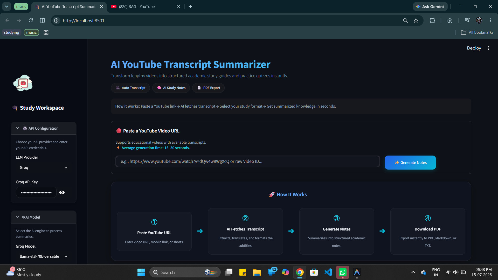

### 2. Live URL Validation
As soon as you paste a YouTube link, the application performs live formatting check validation to confirm the link structure.
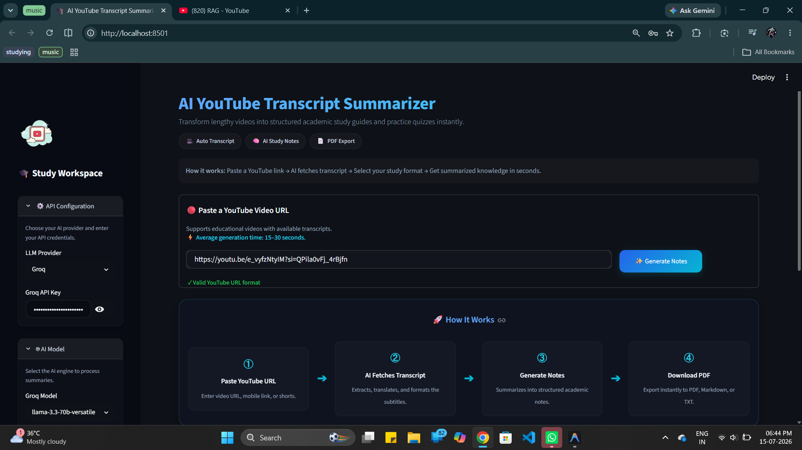

### 3. Active Generation Pipeline
When you click the **Generate Notes** button, a multi-stage loading progress bar tracks each task in real-time, showing the active phase and estimated remaining time.
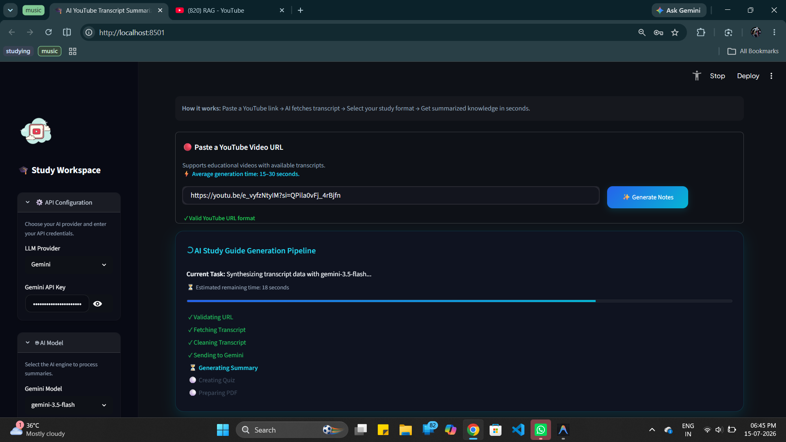

### 4. Generation Pipeline Completion
All stages are executed sequentially and package the formatted summaries into downloadable buffers.
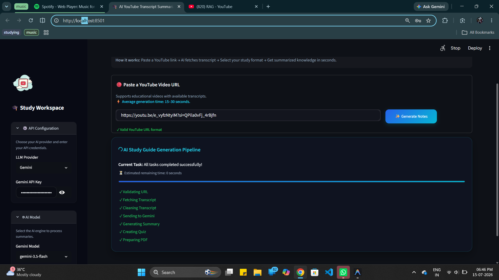

### 5. Results KPI Dashboard
A dynamic, metadata-driven metric dashboard calculates video duration, word counts, reading estimates, keywords, and quiz question counts.
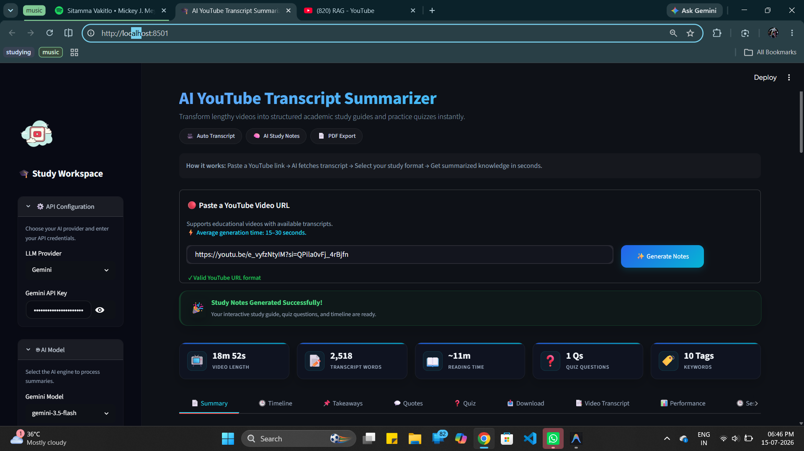

### 6. Interactive Workspace Tabs

#### 📄 Summary Notes
Deep-dive, structured notes complete with difficulty level indicators and core executive outlines.
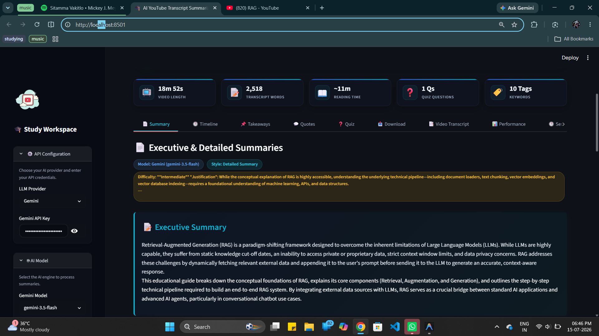

#### 🕒 Chronological Video Timeline
A clean, scannable table mapping topics directly to timestamps in the video.
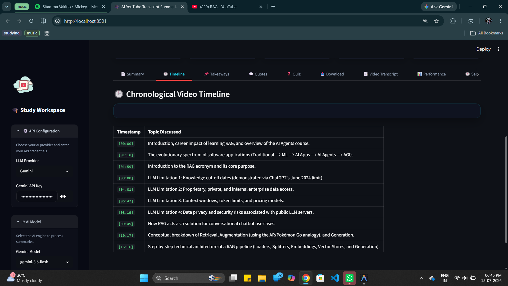

#### 📌 Key Takeaways & Technical Concepts
Core learnings, lessons, and definitions mapped out.
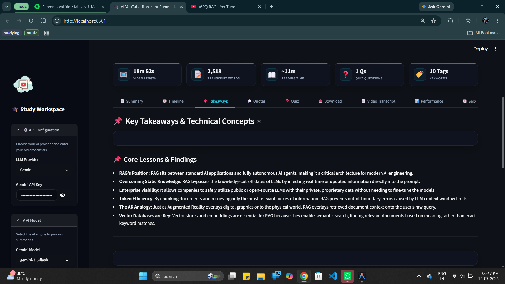

#### 💬 Important Quotes
Highlighted notable statements and citations from the video transcript.
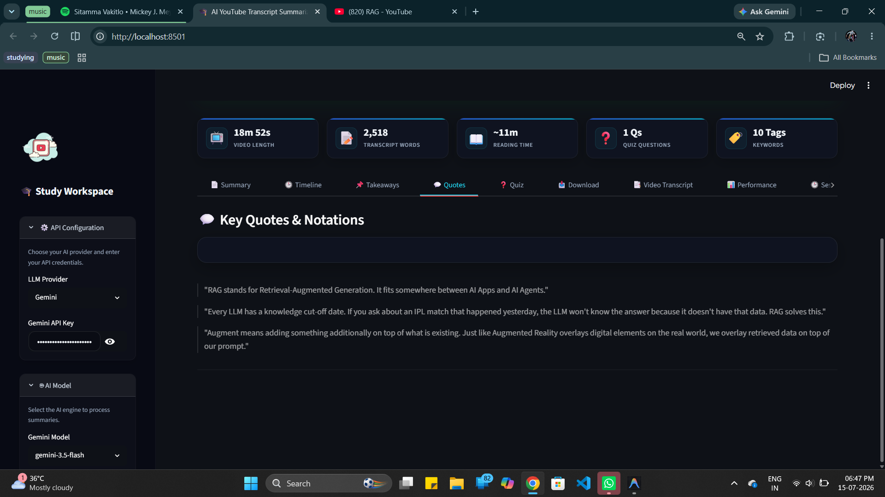

#### ❓ Practice Quizzes
Interactive multiple-choice practice quizzes with instant answer checkmarks and explanations.
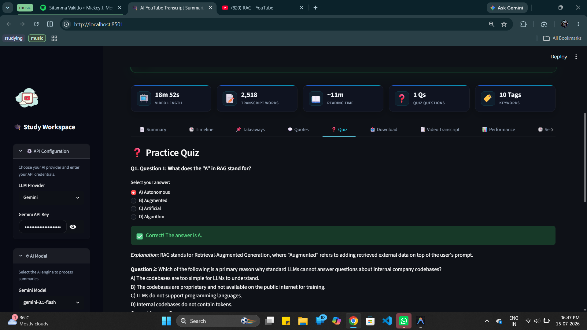

#### 📥 Download & Export
Export study guides to printable PDF formats, standard Markdown (`.md`), or plain Text (`.txt`).
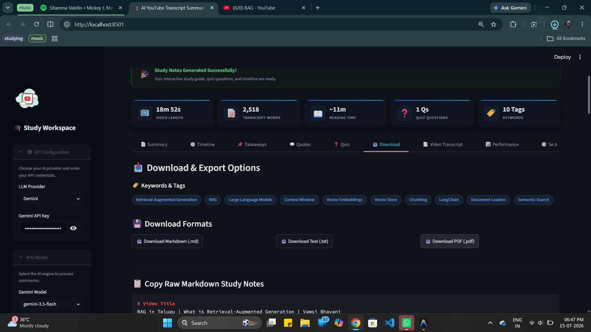

#### 📥 PDF Export Complete
Instant browser download trigger for custom PDF sheets.
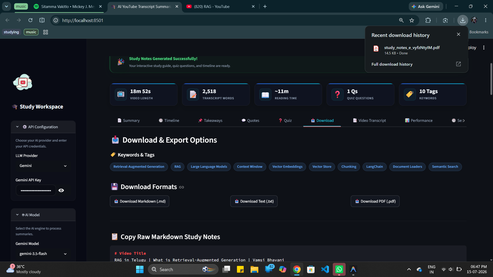

#### 📑 Video Transcript Preview
A continuous paragraph preview of the transcript segments in their original language.
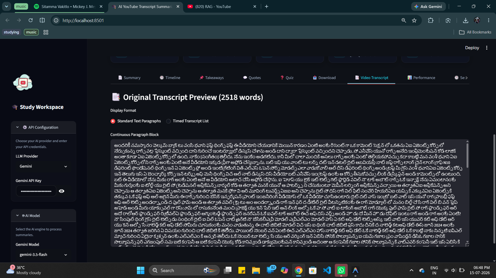

#### 🕒 Session History Cache
A history panel letting you cache and reload previous summaries in a single click.
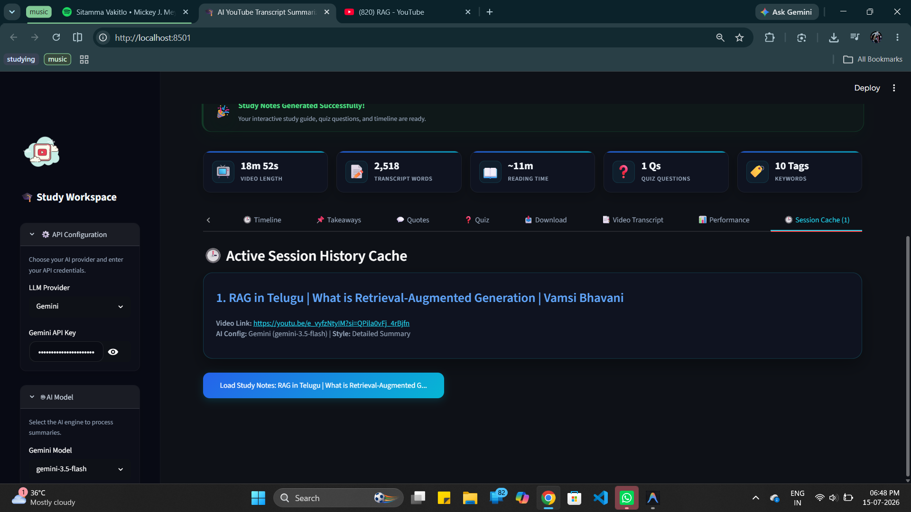


